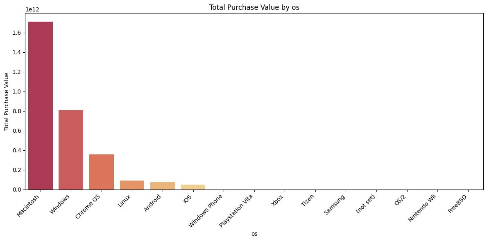
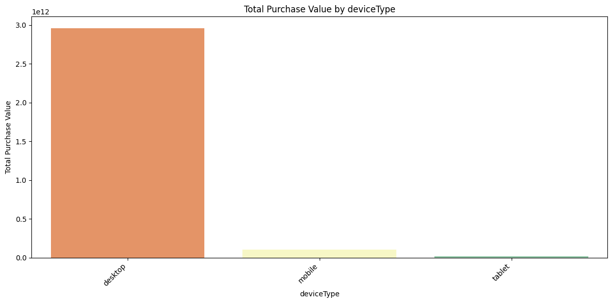
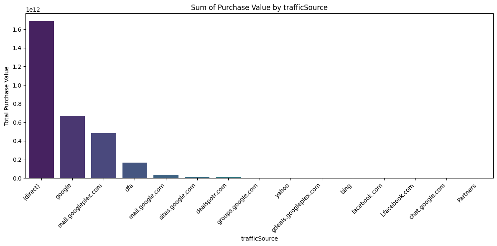
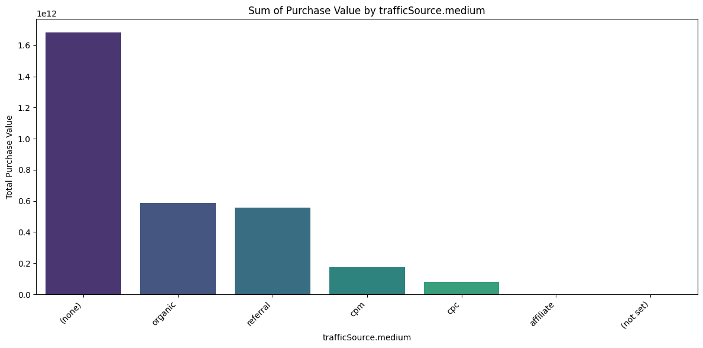
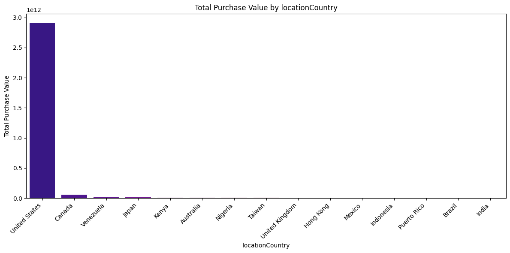
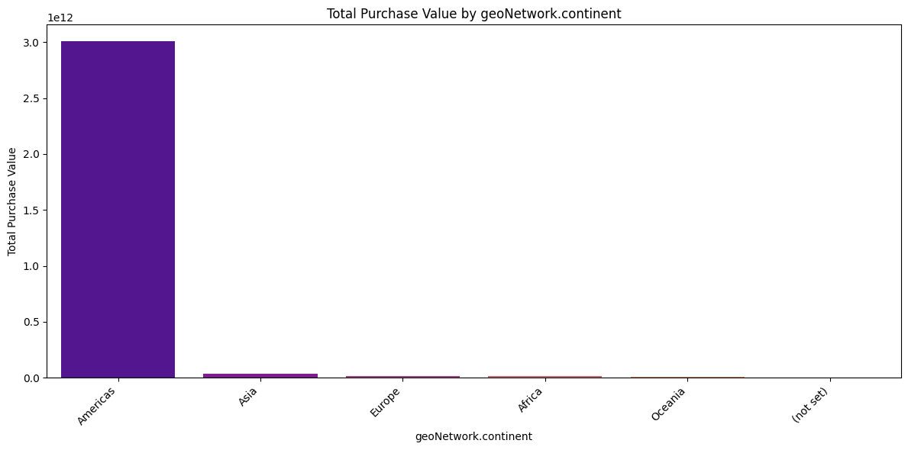
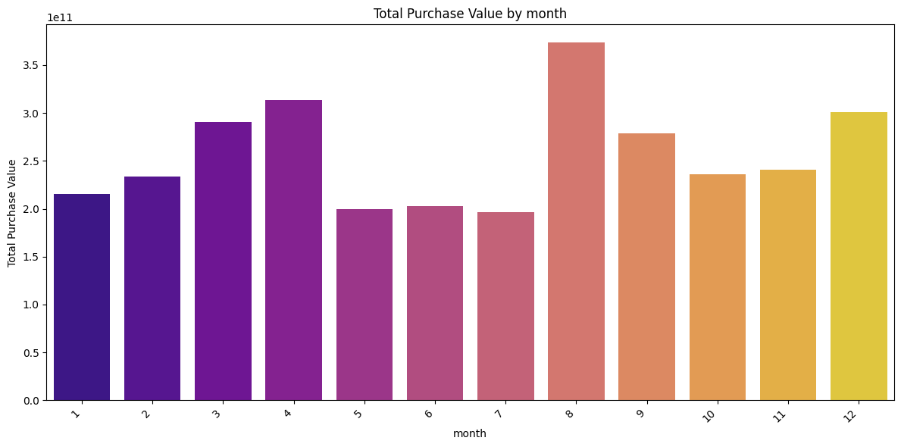
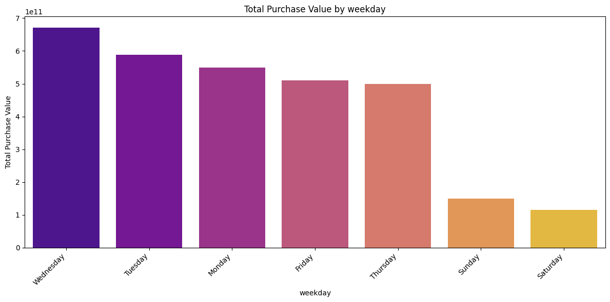

# Engage 2: Predicting Purchase Value from Clicks to Conversions


Kaggle competition project for the IIT Madras BS Degree **MLP Project (T2 2025)**.
Goal: predict the **`purchaseValue`** of a digital-commerce session from user behaviour, device, traffic-source and geography features. Submissions are scored with **R²** on the true target.

- Competition: `engage-2-value-from-clicks-to-conversions` (Apr 23 - Jul 28, 2025)
- Task type: tabular regression, heavily zero-inflated and right-skewed target

## Dataset

Each row is one user session. The data is **not** in this repo (see [`data/README.md`](data/README.md)).

| Group | Example columns |
|-------|-----------------|
| User behaviour | `totalHits`, `pageViews`, `totals.bounces`, `new_visits`, `sessionNumber` |
| Device | `deviceType`, `os`, `browser`, `device.isMobile` |
| Traffic / marketing | `userChannel`, `trafficSource`, `trafficSource.medium`, `trafficSource.referralPath`, `gclIdPresent`, `trafficSource.adwordsClickInfo.*` |
| Geography | `geoCluster`, `geoNetwork.*`, `locationCountry` |
| Time | `date` |
| Target | `purchaseValue` |

Key facts found in the EDA: the median, 25th and 75th percentile of `purchaseValue` are all 0 while the mean is about 26M and the maximum about 23.1B, so almost every session buys nothing and a few huge purchases dominate. `sessionNumber` ranges from 1 to 447, and 5,304 duplicate rows were removed from the training data.

## Approach

```
raw CSV -> clean -> impute -> encode -> scale -> (RFE) -> XGBoost -> submission.csv
```

1. **Cleaning** - placeholder strings (`(not set)`, `(not provided)`, `(none)`, `not available in demo dataset`, `Not Socially Engaged`) become `NaN`. 14 all-empty/constant columns and 5 ID/constant columns (`userId`, `sessionId`, `sessionStart`, `locationZone`, `screenSize`) are dropped. Duplicates are removed from train.
2. **Feature engineering** - `month` and `year` from `date` (both showed signal in the EDA).
3. **Imputation** - most-frequent for a few skewed columns, a `"constant"` category for sparse categoricals, `0`/`False`/`True` for flag columns.
4. **Encoding** - one-hot for low-cardinality columns; one-hot limited to the top categories (rest grouped as *infrequent*) for high-cardinality ones; ordinal for boolean-like columns.
5. **Scaling** - `RobustScaler` on `sessionNumber` and `pageViews` (outliers were kept because the test set is hidden).
6. **Models compared** - Gradient Boosting, Random Forest, XGBoost; then RFE (25 features) and a grid search on XGBoost.

### EDA highlights

Total purchase value by segment (train data):

| | |
|---|---|
|  |  |
|  |  |
|  |  |
|  |  |

Observations recorded in the notebook: Macintosh and desktop sessions carry the most purchase value; direct traffic and non-ad-click sessions buy more; the US / Americas dominate; weekdays beat weekends; 2017 and August are the strongest year and month.

## Results

Scores as recorded in the notebook (the "test" figure is the Kaggle submission score; the test labels are hidden):

| Model | R² train | R² test |
|-------|---------:|--------:|
| Gradient Boosting | 0.63 | 0.24 |
| Random Forest | 0.93 | 0.40 |
| XGBoost | 0.83 | 0.47 |
| XGBoost + RFE(25) + grid search (final) | 0.95 | **0.52** |

All models overfit: the train-test gap is large, which is the main thing to fix next.

Leaderboard rank: _add yours here (screenshot in `reports/`)_.

## Repository structure

```
.
├── notebooks/01_eda_preprocessing_modelling.ipynb   # original Kaggle notebook (with outputs)
├── src/purchase_value/
│   ├── config.py           # column groups, model presets
│   ├── preprocessing.py    # clean() + sklearn preprocessing pipeline
│   └── train.py            # hold-out R², refit, write submission
├── tests/                  # run on synthetic data with the same schema
├── reports/figures/        # EDA plots used in this README
├── data/                   # put train_data.csv / test_data.csv in data/raw (git-ignored)
├── submissions/            # generated CSVs (git-ignored)
└── requirements.txt, Makefile, .github/workflows/ci.yml
```

## Run it

```bash
python -m venv .venv && source .venv/bin/activate
make install
# download the data into data/raw (see data/README.md)

make train              # regularised XGBoost + hold-out R²  -> submissions/submission.csv
make train-notebook     # deep-tree XGBoost + RFE(25), the settings behind the 0.52 submission
make test
```

`train.py` first fits on 80% of the training data and prints a **hold-out R²**, then refits on everything and writes `submissions/submission.csv` (`id`, `purchaseValue`; predictions are clipped at 0). Upload that file to the competition page.

> The `src/` pipeline is a port of the notebook and is tested on synthetic data with the competition's column names. It has not been run on the real (non-redistributable) data, so its scores may differ slightly from the notebook's.

## Limitations of the original notebook, and what to try next

- The notebook never scored a validation split (its `train_test_split` result is unused); "test" numbers come from Kaggle submissions. `train.py` adds a real hold-out score. A `GroupKFold` on user would be more honest still.
- The grid-search grid mixes Random Forest parameters (`min_samples_split`, `min_samples_leaf`, `max_features`) into an `XGBRegressor`, and the search estimator is the earlier `xgb` object rather than the one built with the grid. Re-tune with real XGBoost parameters (`learning_rate`, `max_depth`, `subsample`, `colsample_bytree`, `min_child_weight`, `reg_lambda`).
- Ideas: a two-stage model (P(purchase) x expected value), robust/Huber losses, user-level aggregates from `userId`, LightGBM/CatBoost, target encoding for high-cardinality columns. R² is measured on the raw scale, so check any target transform against it.

## Acknowledgements

Competition and data by the IIT Madras BS Degree program on Kaggle. Please follow the competition rules: do not commit the data.

## License

MIT - see [LICENSE](LICENSE). Replace `<Your Name>` in the license before publishing.
